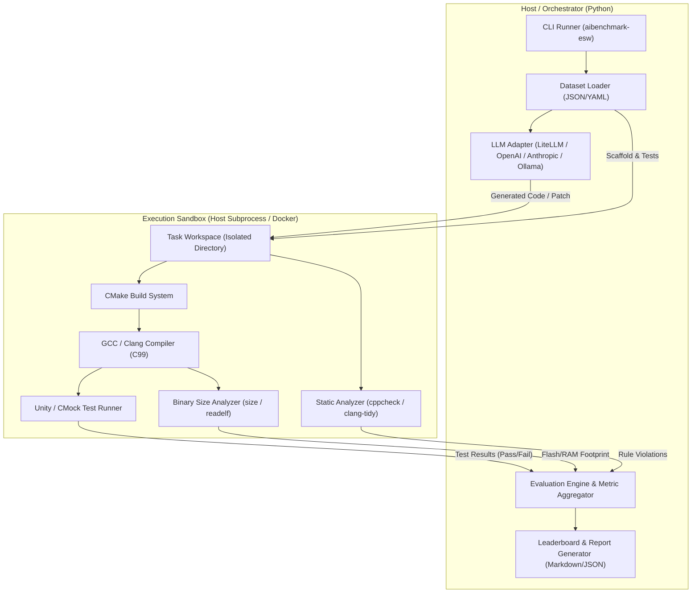

# Embedded AI Coding Benchmark (`AIBenchMark-ESW`) Design Document

## 1. 개요 (Overview)

`AIBenchMark-ESW`은 임베디드 소프트웨어 개발 영역에 특화된 최초의 오픈소스 AI 코딩 벤치마크 프레임워크입니다.
기존의 SWE-bench, HumanEval 등이 Python, Web, 일반 알고리즘 위주의 평가를 수행하는 한계를 극복하고, 자원 제약(Flash/RAM), 하드웨어 인터페이스(Mock HAL), 상태 머신(FSM), 동시성/인터럽트, 그리고 정적 안전 규칙(MISRA-C) 등 **실제 임베디드 펌웨어 개발 환경의 요구사항을 반영한 다차원 평가**를 제공합니다.

---

## 2. 핵심 설계 목표 (Design Goals)

1. **임베디드 특화 다차원 평가 (Multi-Dimensional Metrics)**:
   단순한 테스트 케이스 Pass/Fail뿐만 아니라 메모리 풋프린트(Flash/RAM)와 정적 코드 안전성(MISRA-C / Clang-Tidy)을 복합적으로 채점.
2. **독립적이고 재현 가능한 테스트베드 (Reproducible Test Harness)**:
   호스트 환경(x86/ARM)에서 Unity/CMock 기반의 Mock HAL을 사용하여 실제 타겟 하드웨어 없이도 고속으로 검증 가능.
3. **확장 가능한 티어(Tier) 기반 문제 구성**:
   기본 자료구조부터 주변장치 드라이버, 실전 펌웨어 버그 픽스까지 난이도 및 카테고리별 티어 제공.
4. **표준 AI 프레임워크 호환성**:
   Python 기반의 CLI 및 LiteLLM 연동을 통해 다양한 상용/오픈소스 LLM(OpenAI, Claude, Ollama, vLLM 등)을 쉽게 평가.

---

## 3. 시스템 아키텍처 (System Architecture)

### 3.1 컴포넌트 구성



### 3.2 컴포넌트 상세 명세

1. **`aibenchmark_esw.llm.client` (LLM Client)**:
   - LiteLLM을 래핑하여 모델 호출 통일화.
   - 프롬프트 템플릿(시스템 프롬프트, 인터페이스 헤더, C99 제약사항) 주입.
   - 코드 블록(````c ... ````) 자동 추출 및 구문 클리닝.
2. **`aibenchmark_esw.sandbox.executor` (Execution Sandbox)**:
   - 태스크별 임시 작업 디렉토리 생성 및 코드 주입.
   - CMake 빌드 및 CTest 실행 제어.
   - 실행 타임아웃 및 메모리 제한 관리.
3. **`aibenchmark_esw.sandbox.size_analyzer` (Size Analyzer)**:
   - 빌드된 오브젝트/ELF 파일에 대해 `size` 도구를 구동.
   - `.text` + `.rodata` (Flash 소비량) 및 `.data` + `.bss` (RAM 소비량) 파싱.
4. **`aibenchmark_esw.sandbox.static_analyzer` (Static Analyzer)**:
   - `cppcheck --enable=all` 및 `clang-tidy` 실행.
   - 경고/에러 건수 및 치명적 취약점(메모리 오버런, 널 포인터) 검출.
5. **`aibenchmark_esw.metrics.scorer` (Score Aggregator)**:
   - 수집된 메트릭을 바탕으로 복합 점수 산출 및 결과 JSON 생성.

---

## 4. 문제 티어(Tier) 설계 및 데이터셋 구조

### 4.1 티어 분류

| 티어 (Tier) | 카테고리 | 대표 태스크 | 검증 포인트 |
| :--- | :--- | :--- | :--- |
| **Tier 1: Core Fundamentals** | 임베디드 기본 자료구조 & 알고리즘 | `ring_buffer`, `fixed_point`, `crc16_ccitt`, `pid_controller` | 버퍼 오버플로우 방지, 0으로 나누기 예외 처리, 비트 연산 정확도 |
| **Tier 2: FSM & Protocols** | 상태 머신 & 프로토콜 파서 | `debounce_fsm`, `slip_packet_parser`, `at_command_parser` | 비동기 스트림 파싱, 유한 상태 머신 전이, 노이즈 복구 |
| **Tier 3: Device Drivers** | Mock HAL 기반 주변장치 제어 | `i2c_sensor_driver`, `spi_flash_driver`, `uart_dma_ring` | 레지스터 시퀀스 준수, 타임아웃 처리, 에러 코드 반환 |
| **Tier 4: Bug Fix & Safety** | 펌웨어 버그 픽스 (SWE-bench 스타일) | `irq_race_condition_fix`, `bitmask_overflow_fix` | 기존 코드 이해력, 비침습적 최소 패치, 회귀 방지 |

### 4.2 태스크 디렉토리 레이아웃

```text
tasks/
  └── <task_id>/
      ├── task.json             # 문제 메타데이터
      ├── prompt.md             # AI에게 제공되는 프롬프트 명세
      ├── include/              # API 헤더 및 Mock HAL 정의
      │   └── <module>.h
      ├── src/                  # 구현 대상 소스 코드 (기본 stub)
      │   └── <module>.c
      ├── tests/                # Unity 단위 테스트 스위트
      │   ├── test_<module>.c
      │   └── CMakeLists.txt
      └── reference/            # 기준점(Baseline) 정답 코드
          └── <module>.c
```

`task.json` 구조:
```json
{
  "id": "tier1_ring_buffer",
  "name": "Lock-free Single Producer Single Consumer Ring Buffer",
  "tier": 1,
  "category": "core_fundamentals",
  "target_standard": "c99",
  "limits": {
    "max_flash_bytes": 1024,
    "max_ram_bytes": 256,
    "timeout_seconds": 10
  },
  "weights": {
    "functional": 0.6,
    "memory": 0.2,
    "safety": 0.2
  }
}
```

---

## 5. 다차원 평가 메트릭 (Scoring Metrics)

### 5.1 점수 계산 공식

1. **기능 정확성 ($S_{func}$)**:
   $$S_{func} = \frac{\text{통과한 Unity 테스트 케이스 수}}{\text{전체 Unity 테스트 케이스 수}} \times 100$$
   * 컴파일 실패 또는 크래시 발생 시 $S_{func} = 0$.

2. **메모리 효율성 ($S_{mem}$)**:
   - 측정 크기 $M_{actual} = (\text{Flash} + \text{RAM})$, 기준 크기 $M_{ref}$ (레퍼런스 코드 크기), 상한 $M_{max}$.
   - $M_{actual} \le M_{ref}$ 인 경우: $S_{mem} = 100$
   - $M_{ref} < M_{actual} \le M_{max}$ 인 경우:
     $$S_{mem} = \max\left(0, 100 - 100 \times \frac{M_{actual} - M_{ref}}{M_{max} - M_{ref}}\right)$$
   - $M_{actual} > M_{max}$ 인 경우: $S_{mem} = 0$

3. **코드 안전성 ($S_{safety}$)**:
   $$S_{safety} = \max(0, 100 - (10 \times N_{error} + 2 \times N_{warning}))$$
   - $N_{error}$: 정적 분석 치명적 오류 (메모리 리크, 버퍼 오버플로우, 널 포인터)
   - $N_{warning}$: MISRA-C 권고 위반 및 경고

4. **종합 점수 ($S_{total}$)**:
   $$S_{total} = (0.6 \times S_{func}) + (0.2 \times S_{mem} \times \frac{S_{func}}{100}) + (0.2 \times S_{safety} \times \frac{S_{func}}{100})$$
   *(기능 테스트를 완전히 통과하지 못한 경우 메모리 및 안전성 점수에 기능 통과율 가중치가 적용됨)*

---

## 6. CLI 인터페이스

- `aibenchmark-esw list [--tier <N>]`: 사용 가능한 태스크 목록 조회
- `aibenchmark-esw run --model <model_name> [--tasks <task_id>] [--tier <N>] [--output <file>]`: AI 모델 호출 및 벤치마크 평가 실행
- `aibenchmark-esw eval --task <task_id> --solution-dir <dir>`: 로컬 작성 코드 직접 평가 (테스트 및 디버깅용)
- `aibenchmark-esw report --results <file_or_dir> [--format markdown|json]`: 리포트 및 리더보드 출력
